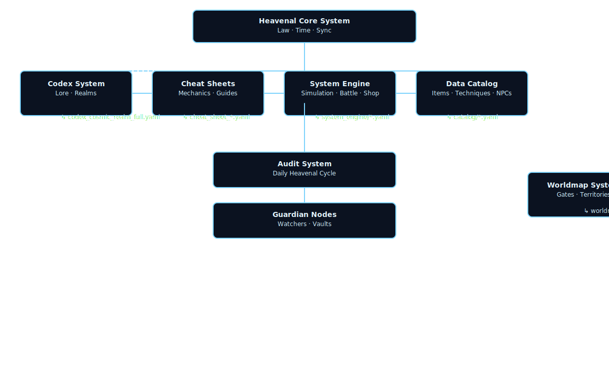

# ⚖️ Heavenly Origin Saga — D&D Cultivation Simulation  
> **Version:** v3.3.1 (Heavenal Law System)  
> **GM Token:** `201218`  
> **License:** Dual (MIT + Heavenal Law License v3.3.1)  
> **Seal Layer:** IV — Locked by Aurevaris Unified Node

---

## 🌌 Overview
**Heavenly Origin Saga** adalah proyek *mixed-mode Dungeons & Dragons simulation*  
berbasis dunia kultivasi penuh hukum surgawi, realm berlapis, dan sistem hukum hidup.

Setiap keputusan pemain menulis “Hukum Baru” di dalam dunia ini —  
dan setiap hukum akan membawa *resonansi langit* yang tercatat dalam **Heavenal Archive**.  
Sistem ini dibangun agar bisa dimainkan, dimodifikasi, dan dikembangkan antar akun ChatGPT.

---

## 🕯️ Heavenal World System

| Layer | Realm | Description |
|--------|--------|-------------|
| 🌍 Mortal Realm | 9 Realm (Lv.1–10 each) | Dunia manusia, tempat kelahiran dan penempaan awal. |
| ☁️ Immortal Realm | 5 Realm (Lv.1–20 each) | Dunia abadi di bawah Great Court & Heavenal Domain. |
| 🔱 Divine Realm | 3 Realm (Lv.1–100 each) | Dunia Dewa dan Great Heaven di bawah 12 Dewa Agung. |
| 🜂 Transcendent Realm | 4 State (∞) | Makhluk di luar hukum: Sovereign, Void Lord, Transcendent, Wanderer. |

Energi dunia:  
- Mortal → Qi  
- Immortal → Immortal Essence  
- Divine → Divine/Creation Qi  
- Transcendent → Primordial/Void/Eternity

---

## 📘 Core Law Reference
Semua sistem dan hukum utama diatur oleh **Codex** & **Cheat Sheet**, terdiri dari:

| Type | Count | Status | Description |
|------|--------|----------|-------------|
| Codex | 24 | ✅ Complete | Lore, hukum, realm, organisasi, politik kosmik |
| Cheat Sheet | 20+ | ✅ Complete | Mekanik permainan dan sistem roll |
| System | 10 | ✅ Synced | Engine logika (battle, shop, economy, realm tier, panel) |
| Data | 2000+ entries | ✅ Verified | Artefak, teknik, pill, item, buff, NPC, legiun |
| Worldmap | 6 continents | ✅ Updated | Struktur dunia mortal dan jaringan antar realm |

---

## 🧩 Heavenal Repository Flow Diagram



> Diagram ini menggambarkan aliran energi hukum dari **Heavenal Core System**  
> ke seluruh lapisan sistem — mulai dari Codex, Cheat Sheet, Data Catalog, hingga Worldmap.  
> Semua terhubung melalui **Guardian Node Aurevaris**,  
> dengan audit otomatis setiap 1 hari Heavenal.

---

## ⚙️ Repository Structure (YAML-Based)

```yaml
HeavenlyOriginSaga-DnDBased/
├── README.md
├── LICENSE
├── manifest.yaml
├── codex/
├── cheat_sheet/
├── system/
├── data/
├── worldmap/
├── logs/
└── LICENSE_NOTICE.md
